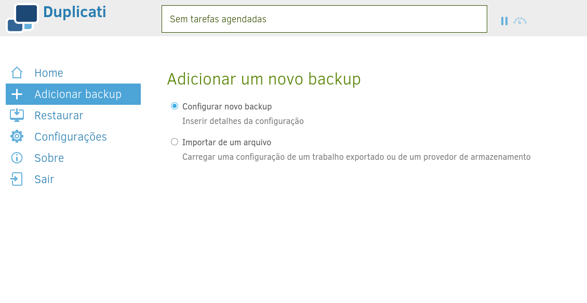
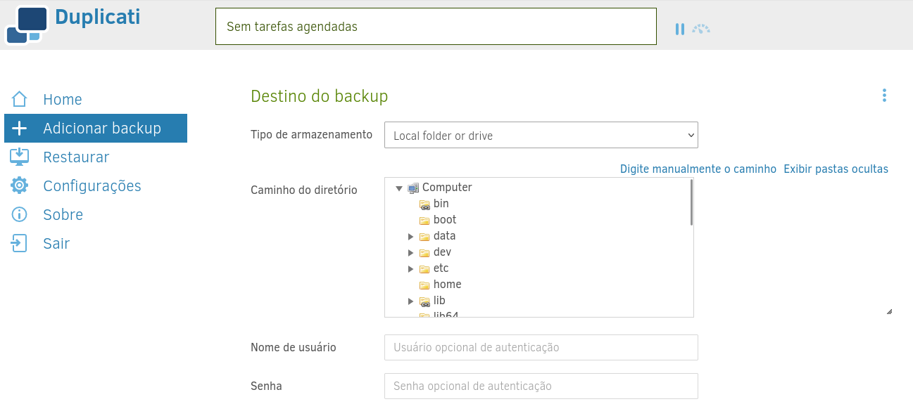
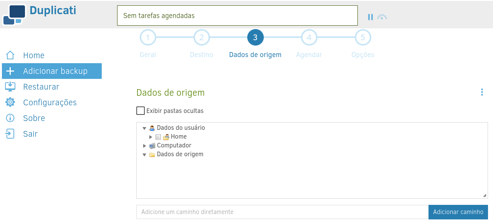
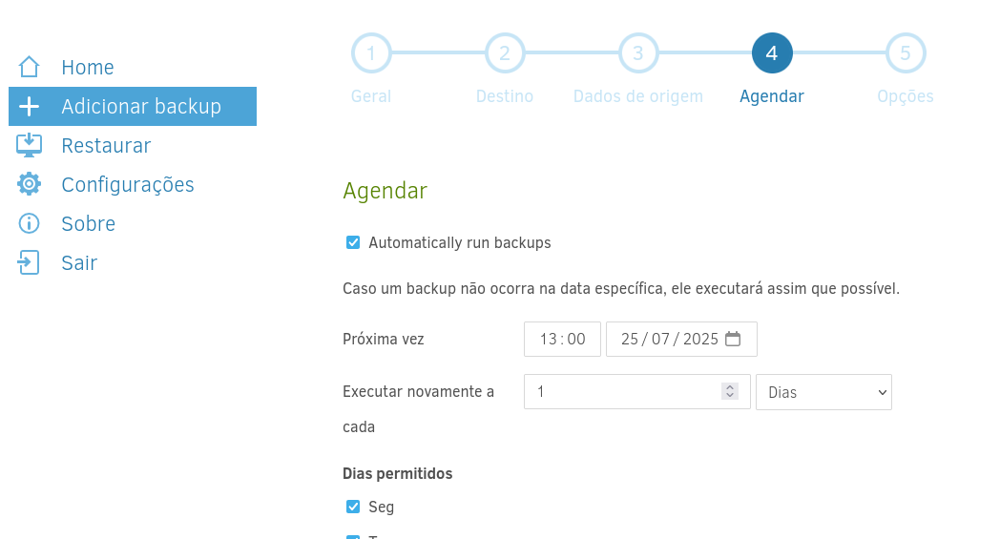
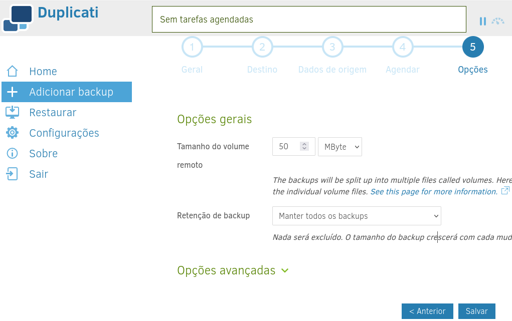

Backup
======

- O backup será configurado utilizando uma das ferramentas abaixo. Não será necessário realizar backup do código fonte dos softwares, pois serão utilizados imagens Docker disponíveis no ``hub`` do Docker e aprimoradas quando necessário.

Rotina de backup
----------------

- Por definição, uma rotina de backup é:

  .. code-block:: text

     Rotinas de backup são processos sistemáticos e planejados de criação de cópias de segurança de dados e informações armazenadas em sistemas eletrônicos.

- É possível definir uma rotina de backup global para o servidor ou uma rotina de backup específica para cada sistema.
- Para tornar mais célere o processo de recuperação de dados, é recomendado **uma rotina de backup para cada sistema**

- Usualmente os arquivos que são incluídos na rotina de backup são:

  1) Diretórios com arquivos de usuários
  2) Arquivos de ``dump`` de banco de dados
  3) Arquivos de configuração

Ferramentas disponíveis
----------------------

+------------+----------------------+----------------+---------------------+-------------------+---------+
| Ferramenta | Sistemas Operacionais| Tipo de Backup | Recursos Principais | Facilidade de Uso | Licença |
+============+======================+================+=====================+===================+=========+
| Duplicati  | Windows, Linux, macOS| Incremental,   | Criptografia,       | Fácil             | LGPL    |
|            |                      | Completo       | Agendamento, Suporte| (Interface Web)   |         |
|            |                      |                | a múltiplos destinos|                   |         |
+------------+----------------------+----------------+---------------------+-------------------+---------+
| Bacula     | Linux, Unix          | Completo,      | Backup para         | Moderada          | AGPL    |
|            |                      | Incremental,   | empresas,           |                   |         |
|            |                      | Diferencial    | Gerenciamento       |                   |         |
|            |                      |                | centralizado        |                   |         |
+------------+----------------------+----------------+---------------------+-------------------+---------+
| Clonezilla | Linux, Multiplataforma| Imagem de disco| Backup de sistema,  | Intermediária     | GPL     |
|            |                      | completa       | Clonagem de disco   |                   |         |
+------------+----------------------+----------------+---------------------+-------------------+---------+
| UrBackup   | Windows, Linux       | Incremental,   | Backup em rede,     | Fácil             | GPL     |
|            |                      | Completo       | Interface web       |                   |         |
+------------+----------------------+----------------+---------------------+-------------------+---------+
| Amanda     | Linux, Unix, Windows | Incremental,   | Backup corporativo, | Complexa          | BSD     |
|            |                      | Completo       | Múltiplos destinos  |                   |         |
+------------+----------------------+----------------+---------------------+-------------------+---------+
| BackupPC   | Linux, Unix          | Incremental    | Baixo consumo de    | Moderada          | GPL     |
|            |                      |                | espaço, Deduplicação|                   |         |
+------------+----------------------+----------------+---------------------+-------------------+---------+

Política de retenção de dados
----------------------------

- Definir uma política de retenção de dados é fundamental e varia conforme o projeto e espaço disponível para armazenamento dos backups.

- Possíveis configurações:

  1) Manter todas versões: Nada será excluído. O backup crescerá a cada modificação.
  2) Excluir backups mais antigos que: Se um novo backup for encontrado, todos os backups anteriores a esta data são excluídos.
  3) Manter um número específico de backups: Se existir mais backups do que o número especificado, os backups mais antigos serão excluídos.
  4) Retenção de backup personalizada: reter 1 backup de cada semana, 1 de cada mês e 1 de cada ano.

Configurar política de retenção
-----------------------------------------------------------------

- A política de retenção deverá ser configurada apropriadamente no software de backup.

- Antes de configurar o backup propriamente, defina um local de armazenamento: servidor S3, HD Externo, etc.

Duplicati
~~~~~~~~~

- Configurar rotinas de backup no Duplicati podem ser feitas através da interface gráfica ou pela linha de comando.

Interface gráfica
~~~~~~~~~~~~~~~~~
Depois que o Duplicati estiver em execução, você poderá configurar um backup pela interface do usuário. 
Usualmente o serviço estará disponível no endereço `SEU-IP:8006`

Na interface do usuário, clique em "Adicionar backup" e escolha a opção "Configurar um novo backup":

Alguns detalhes são necessários para configurar um novo backup e estão divididos em 5 etapas:
1. Configuração básica (nome descritivo, senha)
2. Destino de armazenamento (onde armazenar os backups)
3. Dados de origem (quais dados devem ser copiados)
4. Agendamento (executar backups automaticamente)
5. Retenção e outros (quando excluir backups antigos e mais)``

1. Configuração básica
Defina um nome para a rotina e uma senha de ecriptação para os dados.
.. warning::
    Salve essa senha em um local seguro. Sem ela não será possível acessar os dados em caso de restauração ou validação da integridade dos backups.

2. Destino de armazenamento
O destino de armazenamento é sem dúvida a etapa mais técnica, pois é onde você especifica como se conectar ao provedor de armazenamento onde deseja armazenar suas informações. 
Alguns destinos exigem apenas uma única configuração, enquanto outros exigem várias.

.. note::
    Cada backup criado pelo Duplicati requer uma pasta separada. Não crie dois backups que usem a mesma pasta de destino, pois eles continuarão se desfazendo.

- Na opção `Tipo de armazenamento` selecione `S3 compatível` ou a opção que se adequar ao seu cenário.

- Depois de configurado o destino, clique no botão `Teste de Conexão` para validar.
- Em seguida clique em `Próximo`.

3. Dados de origem
- O próximo passo é configurar quais dados estarão na rotina de backup. 
- É possível navegar pela estrutura de diretórios ou inserir o caminho diretamente.

- Na opção `Filtro` é possível excluir diretórios ou arquivos da rotina utilizando expressões regulares.
- Por exemplo, `Excluir arquivos com extensão`  e inserir `.exe` irá excluir os arquivos `.exe` da rotina de backup.

- Na opção `Excluir` é possível deixar de fora da rotina de backup: 
    - Arquivos ocultos
    - Arquivos do sistema
    - Arquivos temporários
    - Arquivos maiores que:

- Clique em `Próximo`:

4. Agendamento
- O próximo passo é agendar quando a rotina de backup será executada.
- Preferencialmente selecione um horário fora do horário de expediente, para evitar sobrecargas no sistema hospedeiro.

- Clique em `Próximo`.

5. Retenção e outros
- Embora o Duplicati tenha desduplicação e compactação para reduzir os dados armazenados, é inevitável que dados antigos sejam armazenados e ocupem espaço, mas não sejam necessários para restauração. 
- Nesta etapa final de configuração, você pode decidir quando versões antigas serão removidas e qual tamanho de arquivo armazenar no destino.

- O tamanho dos volumes remotos é projetado para um tamanho equilibrado, utilizável com armazenamento em nuvem e uma conexão de rede limitada. 
- Se você tiver uma conexão rápida ou armazenar arquivos em uma rede local, considere aumentar o tamanho dos volumes remotos. Para obter mais informações, consulte esta página sobre as compensações entre tamanhos.

- Para a configuração de retenção, é inevitável que os backups aumentem à medida que dados novos e alterados forem adicionados a eles. Se nada for excluído, o tamanho do backup continuará aumentando. Com as configurações de retenção, você pode escolher como remover automaticamente as versões mais antigas.

- A configuração "Retenção inteligente de backup" é útil para a maioria dos usuários, que mantém um backup diário e, gradualmente, reduz o tamanho das versões anteriores.

- Clique no botão `Salvar`.
- Pronto, sua rotina de backup foi configurada.

Linha de comando
~~~~~~~~~~~~~~~~

- A política de retenção pode ser configurada adicionando o seguinte parâmetro à execução do backup:

  .. code-block:: bash

     --retention-policy=1W:1D,4W:1W,12M:1M

- No exemplo acima, a política de retenção é a seguinte: mantém um backup para cada um dos últimos 7 dias, cada uma das últimas 4 semanas e cada um dos últimos 12 meses.

- Onde o comando por completo seria:

  .. note::
     Descrição das variáveis:
     
     NOME-DO-BUCKET: nome do bucket criado no provedor de armazenamento
     
     URL-DO-PROVEDOR: URL do provedor de armazenamento utilizada
     
     LOCATION-DO-ARMAZENAMENTO: localização do bucket criado. Por exemplo: ``eu-central-1``
     
     ACCESS-KEY: chave para acesso ao bucket
     
     SECRET-KEY: senha de acesso ao bucket
     
     PASTA-BACKUP: caminho da pasta a ser backupeada. Por exemplo: ``/var/www/html``
     
     NOME-DA-ROTINA: nome da rotina de backup
     
     NOME-DO-BANCO: nome do banco de dados do Duplicati da rotina de backup
     
     SENHA-DE-CRIPTOGRAFIA-DOS-ARQUIVOS: senha de encriptação dos arquivos. Só será possível a visualização e recuperação dos dados em posse dessa senha.

- O comando ficaria assim:

  .. code-block:: bash

     duplicati-cli backup "s3s://NOME-DO-BUCKET/?s3-server-name=URL-DO-PROVEDOR&s3-location-constraint=LOCATION-DO-ARMAZENAMENTO&s3-storage-class=&s3-client=aws&auth-username=ACCESS-KEY&auth-password=SECRET-KEY" "/PASTA-BACKUP" --backup-name=NOME-DA-ROTINA --dbpath=/data/Duplicati/NOME-DO-BANCO.sqlite --encryption-module=aes --compression-module=zip --dblock-size=50mb --passphrase=SENHA-DE-CRIPTOGRAFIA-DOS-ARQUIVOS --retention-policy=1W:1D,4W:1W,12M:1M --disable-module=console-password-input

- É preciso adicionar à ``crontab`` para que o backup seja executado no horário desejado.
- Exemplo de configuração da Cron (executa todos os dia às 1 horas da manhã):

  .. code-block:: bash

     0 1 * * * duplicati-cli ...